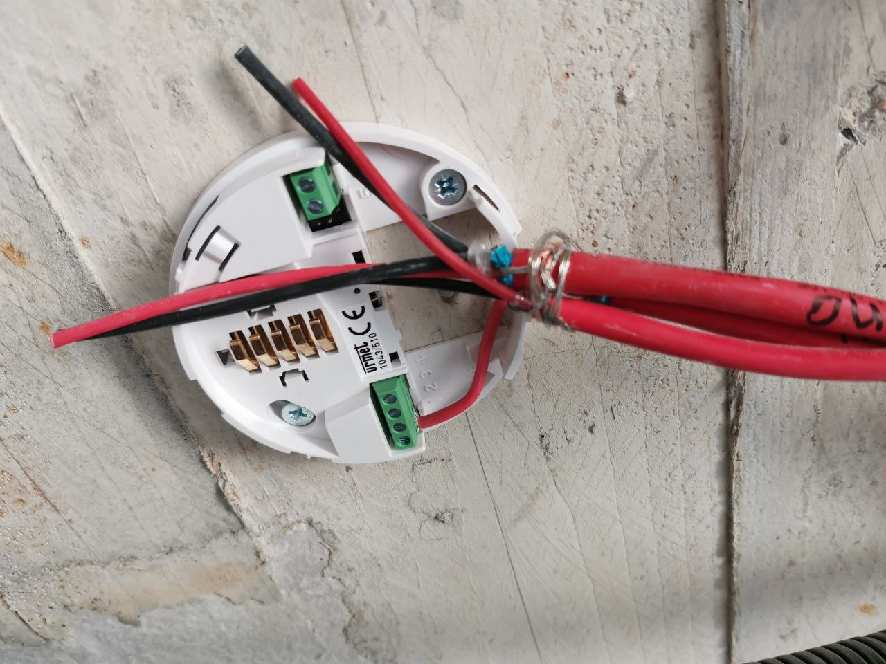
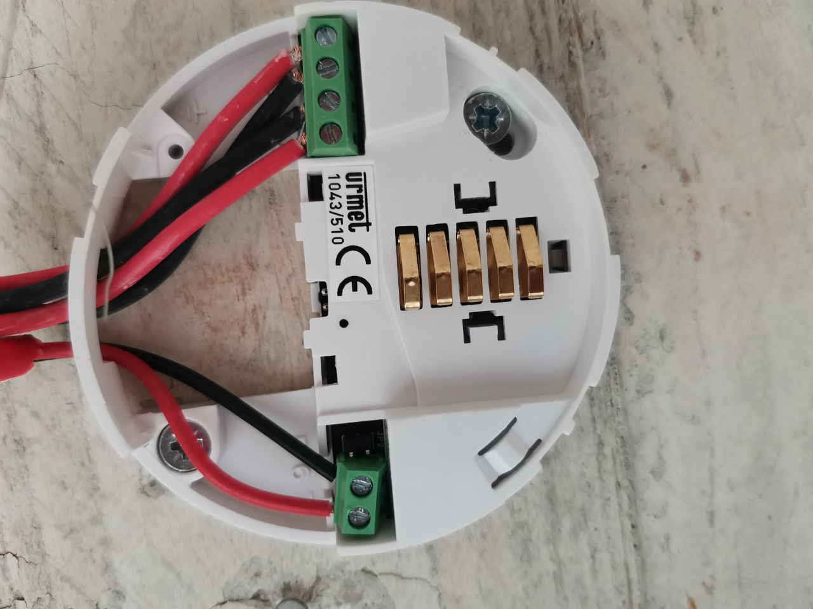
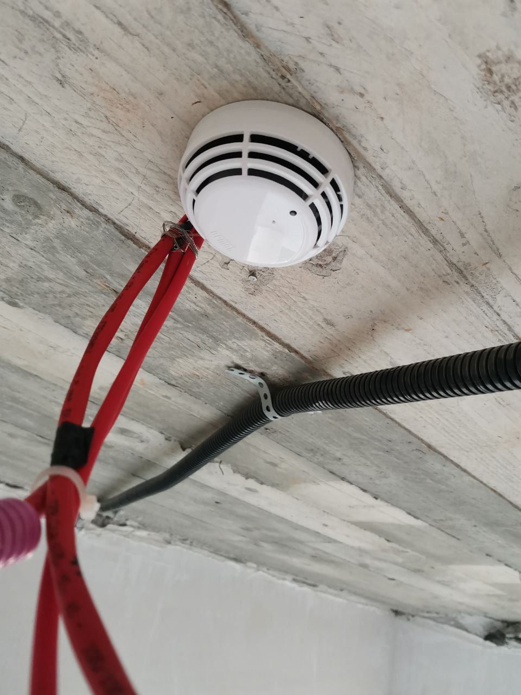
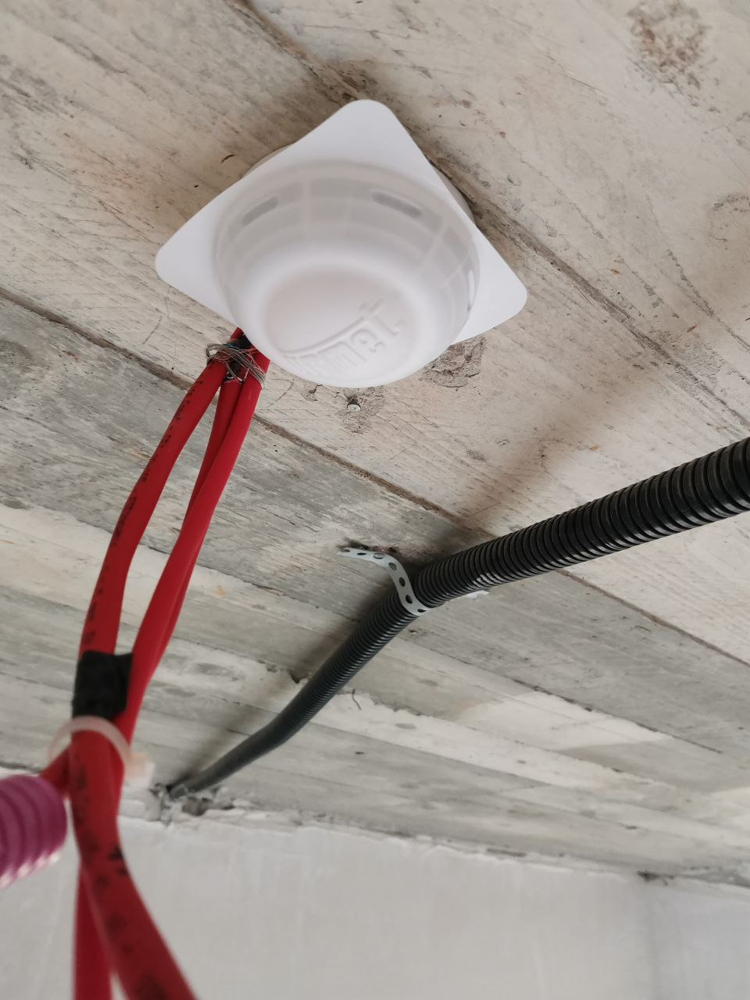

# -Smoke-Detector-Installation-Urmet-1043-510

This article describes the step-by-step process of installing Urmet 1043/510 smoke detectors on a construction site — including ceiling mounting, electrical connections, and component description. The goal was to install detectors in each room and corridor with proper routing and safety in mind.

  
  🔧 Components & Tools Used

Base Urmet 1043/510 (For smoke detector)

Urmet 1043/510 smoke detectors

Electrician’s scissors (for stripping and cutting cables)

Drill with 6 mm masonry bit

Plastic wall plugs (dowels)

Screws & screwdriver

electric screwdriver

Pencil or marker for hole marking

3×2 signal cables (each cable had: 2×1.5 mm² conductors, red & black)

Electrical tape

  
  🧵 Cable Description
Each installation used three cables, and every cable had this structure:

Outer red insulation

Metal shielding foil (wrapped)

Two 1.5 mm² copper wires (red and black)

Fire-resistant fiber-like wrapping

Inner copper conductors

The three cables were:

Input (marked with electrical tape)

Output (looped to the next detector)

Signal Repeater / LED indicator (thinner cable)

  
  🏗️ Mounting & Installation Process
1. Platform Fixing
The detector’s mounting base was aligned to the ceiling, positioned based on best cable route.

Using the base as a template, two holes were marked and drilled (Ø6 mm).

Plastic dowels were inserted, and the base was secured with screws.

2. Stripping and Preparation
All cables were stripped using electrician’s scissors.

Identified cables by purpose:

Input

Output

Signal Repeater

Stripped wires were inserted according to the detector's terminal layout.

  
  ⚡ Wiring According to Manual
Connections were made as follows:

Input Cable

Terminal 1: +

Terminal 2: -

Output Cable

Terminal 3: -

Terminal 4: +

Terminal 5: Jumper (not used)

Repeater Signal (LED):

Terminal 6: -

Terminal 7: + 

  ✅ Final Steps
  
The detector unit was installed onto the platform.

A factory dust cover (likely anti-dust or anti-paint) was placed over the sensor during ongoing construction work.

Later I learned to install cleaner and more accurately

  
  📌 Notes & Observations
Each room and hallway was equipped with a detector.

The cable structure provided excellent protection and clarity.

Marking input/output cables early saved time and prevented confusion.

All detectors were visually inspected and prepared for later system testing.

